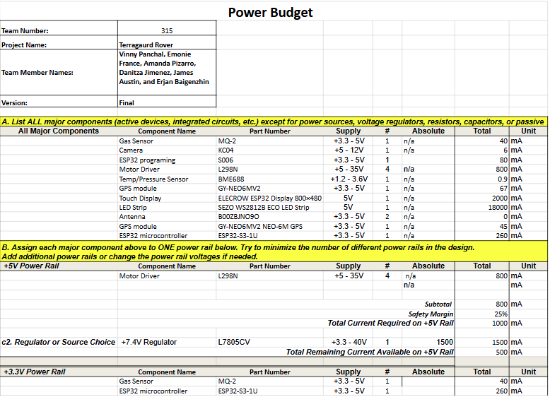
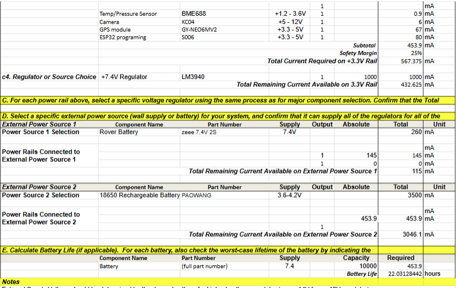

## Overview
After selection all of our components it was split into two power source according to its datasheet. Gas Senor needed to be powered with 3.3V power rail. After adding all the components we added voltage regulator that best fit for each rail.

{style width:"350" height:"300;"}

{style width:"350" height:"300;"}

## Conclusions

A power budget is vital in embedded systems because it keeps all components operating within available power limits (important for battery-powered devices), guides the choice of low-power hardware such as efficient MCUs and regulators, supports design optimization through techniques like sleep modes and duty cycling, and ensures that the power supply is properly sized—avoiding over-design while maintaining performance and extending system lifetime. 
