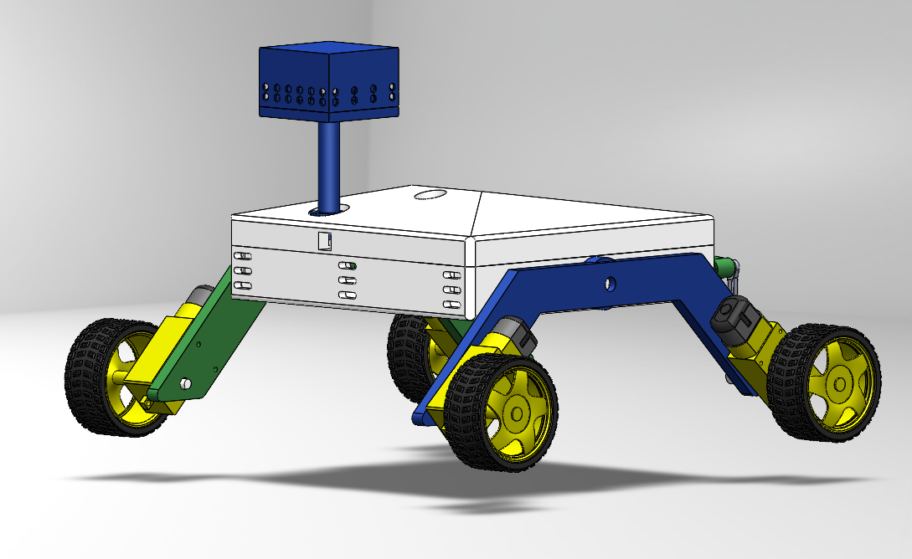
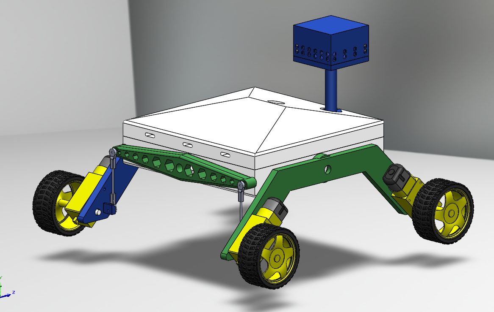

Danitza Datasheet 
as part of 
<b>Phoenix Force</b> 
for 
<b>Team 315</b> 
<strong>Submission: December 08, 2025</strong>

## Introduction
We were task to help wildfire responders since wildfire has increased over the years. Our TerraGuard is a two board rover with a portable screen that has its own wi-fi to communicate with the rover in real time.
### Project Summary
* The rover has BME688(temperature), MQ-2 gas sensor(detects versatile gases), GPS, and motors for mobility. The screen is CrowPanel EP-32-S3 with led to indicate status of the rover's connection and visual awareness if sensors detect changes to the environment.

Full project details and team report: [Phoenix Force Team Report](https://egr314-2025-f-315.github.io/phoenixforce.github.io/)

### My Contribution 

#### Gas Sensor Integration (MQ-2)
Early detection of fire indicators is critical for wildfire prevention. Even small ignitions can rapidly escalate into large-scale fires.  
I selected the MQ-2 sensor for its ability to detect a wide range of combustible gases and smoke. I developed and calibrated the detection code using the Rs/Ro ratio method:

- **Rs** = Sensor resistance in the presence of target gas  
- **Ro** = Sensor resistance in clean air  

This ratio-based approach provides reliable gas concentration readings.

#### Rover Chassis & Display Cover Design
The rover chassis and display cover were modeled in SolidWorks and manufactured through 3D printing. 

### Individual Assignment – Component Selection: MQ-2 Smoke/Gas Sensor
**Key Features:**
- High-quality dual-panel design with power and status indicators
- TTL digital output (LOW when gas detected) – can be directly connected to a microcontroller
- Analog output (0.1–4 V) proportional to gas concentration
- Requires pre-heating (~60 seconds) for stable readings due to internal heating element

**Specifications:**
- Input voltage: DC 5V
- Power consumption: ~150 mA
- DO output: TTL digital 0 and 1 (0.1V / 5V)
- AO output: 0.1–0.3 V (clean air), up to ~4 V at maximum concentration

[Official MQ-2 Datasheet (PDF)](https://cdn.sparkfun.com/assets/3/b/0/6/d/MQ-2.pdf)

---
*EGR 314 – Embedded Systems Design | Fall 2025 | Team 315 – Phoenix Force*
